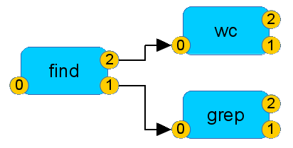
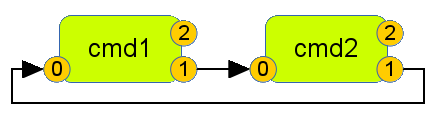

pipexec
=======

Build a network of processes and connecting pipes - and have them act like a single process.

# Introduction and Purpose #
*pipexec* has two major use cases.

## Use Case 1: Handling Arbitrary Pipes between Processes ##

### Basics ###
When it comes to pipes in shells many tutorials introduce
<code>stdin</code>, <code>stdout</code> and <code>stderr</code> which
map to file descriptors 0, 1 and 2 respectively. 

If you want to know how many lines contains the word *bird* in
chapter 1 and 2 of your text, you can use a command like:

    $ cat Chap1.txt Chap2.txt | grep bird | wc -l

And pictures like this are shown to explain what happens internally:

### Advanced ###
The more advanced sections provide information how to use constructs
like <code>2>&1</code> to redirect <code>stderr</code> to
<code>stdout</code>.  And then you might come to the sections for the
pros and nerds. There is explained that you can build up a whole tree
of processes like

    $ find / 1> >(grep .txt) 2> >(wc >/tmp/w.log)

### The Hidden Universe of File-Descriptors, Processes and Pipes ###
Nobody will tell you:

1. <code>stdin</code>, <code>stdout</code> and <code>stderr</code> are
artificial definitions.
2. Also the relation to file descriptors 0, 1 and 2 is artificial.
3. There are more than three file descriptors. On a typical Linux
system each process has by default 1024 - which can be increased if
needed.
4. From starting up processes and generating pipes between them there
is mostly no limitation on system level; shells only support this in a
very limited way.

This is the moment when *pipexec* drops in: with *pipexec* you can
start up any kind of processes and build up pipes between them as you want.

#### Cyclic ####

    $ pipexec -- [ A /usr/bin/cmd1 ] [ B /usr/bin/cmd2 ] "{A:1>B:0}" "{B:1>A:0}"

gives

#### Complex ####
*pipexec* supports any directed graph of processes and pipes like

## Use Case 2: Handle Bunch of Processes like one single Process ##
Most systems to start and run processes during system start-up time do
not support pipe.  If you need to run a pipe of programs from an
/etc/init.d script you are mostly lost.

Depending on your distribution you can be happy if it starts up - but
when it comes to stopping, at least the current Debian
start-stop-daemon and RHEL 6 daemon function fail.

Also here *pipexec* comes in: it starts up processes piped together,
acts like a single process and supports pid file handling.

# Usage
    $ ./pipexec -h
    pipexec version 2.4
    (c) 2014-2015 by Andreas Florath <andreas@florath.net>
    License GPLv2+: GNU GPL version 2 or later <http://gnu.org/licenses/gpl.html>.

    Usage: pipexec [options] -- process-pipe-graph
    Options:
     -h              display this help
     -k              kill all child processes when one 
                     terminates abnormally
     -l logfd        set fd which is used for logging
     -p pidfile      specify a pidfile
     -s sleep_time   time to wait before a restart
    
    process-pipe-graph is a list of process descriptions
                       and pipe descriptions.
    process description: '[ NAME /path/to/proc ]'
    pipe description: '{NAME1:fd1>NAME2:fd2}'

Example:

    $ pipexec -- [LS /bin/ls -l ] [GREP /bin/grep LIC ] '{LS:1>GREP:0}'
    -rw-r--r-- 1 florath florath 18025 Mar 16 19:36 LICENSE

Be sure to escape pipe descriptions.

It is possible to specify a fd for logging.

    $ pipexec -l 2 -- [LS /bin/ls -l ] [GREP /bin/grep LIC ] '{LS:1>GREP:0}'
    2014-05-15 16:30:35;pipexec;23978;pipexec version 2.4
    2014-05-15 16:30:35;pipexec;23978;Number of commands in command line [2]
    2014-05-15 16:30:35;pipexec;23978;Number of pipes in command line [1]
    2014-05-15 16:30:35;pipexec;23978;[LS] command_info path [/bin/ls]
    2014-05-15 16:30:35;pipexec;23978;[GREP] command_info path [/bin/grep]
    2014-05-15 16:30:35;pipexec;23978;{0} Pipe [LS] [1] > [GREP] [0]
    2014-05-15 16:30:35;pipexec;23978;Cannot set restart flag - process will terminate
    2014-05-15 16:30:35;pipexec;23978;Start all [2] children
    [...]

Or

    $ pipexec -l 7 -- [LS /bin/ls -l ] [GREP /bin/grep LIC ] '{LS:1>GREP:0}' 7>/tmp/pipexec.log
    -rw-r--r-- 1 florath florath 18025 Mar 16 19:53 LICENSE
    $ head -2 /tmp/pipexec.log
    2014-05-15 16:30:35;pipexec;23978;pipexec version 2.4
    2014-05-15 16:30:35;pipexec;23978;Number of commands in command line [2]

# Installation #

## From Packages ##
The following Linux distributions include the package.  You can
install pipexec with the distribution's package manager:
* [Debian](https://packages.debian.org/stretch/pipexec)
* [Ubuntu](http://packages.ubuntu.com/wily/pipexec)
* [Archlinux](https://aur.archlinux.org/packages/pipexec-git)
* [Raspbian](https://www.raspbian.org/)
* [Kali](http://www.kali.org)

## From Source ##
[Download the latest tar ball](https://github.com/flonatel/pipexec/releases)

    $ tar -xf pipexec-X.Y.Z.tar.xz
    $ mkdir PIPEXECBUILD
    $ cd PIPEXECBUILD
    $ ${PWD}/../pipexec-X.Y.Z/configure
    $ make

There will be three binaries in the bin directory: pipexec, ptee and
peet.  You can copy / install them as you need.
