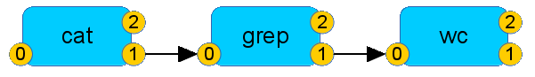
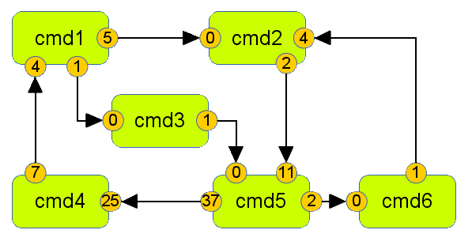

pipexec
=======

Building up a network of processes and pipes between them - acting
like a single process.

# Introduction and Propose #
*pipexec* has two major use cases.

## Use Case 1: Handling Arbitrary Pipes between Processes ##

### Basics ###
When it comes to pipes in shells many tutorials introduce
<code>stdin</code>, <code>stdout</code> and <code>stderr</code> which
map to file descriptors 0, 1 and 2 respectively. 

If you want to know how many times a line contains the word *bird* in
chapter 1 and 2 of your text, you can use a command like:

    $ cat Chap1.txt Chap2.txt | grep bird | wc -l

And pictures like this are shown to explain what happens internally:

### Advanced ###
The more advanced sections provide information how to use constructs
like <code>2>&1</code> to redirect <code>stderr</code> to
<code>stdout</code>.  And then you might come to the sections for the
pros and nerds. There is explained that you can build up a whole tree
of processes like

    $ find / 1> >(grep .txt) 2> >(wc >/tmp/w.log)

### The Hidden Universe of File-Descriptors, Processes and Pipes ###
Nobody will tell you:

1. <code>stdin</code>, <code>stdout</code> and <code>stderr</code> are
artificial definitions.
2. Also the relation to file descriptors 0, 1 and 2 is artificial.
3. There are more than three file descriptors. On a typical Linux
system each process has by default 1024 - which can be increased if
needed.
4. From starting up processes and generating pipes between them there
is mostly no limitation on system level; shells only support this in a
very limited way.

This is the moment when *pipexec* drops in: with *pipexec* you can
start up any kind of processes and build up pipes between them as you want.

#### Cyclic ####

    $ pipexec -- [A /usr/bin/cmd1 ] [B /usr/bin/cmd2 ] {A:1>B:0} {B:1>A:0}

gives

#### Complex ####
*pipexec* supports any directed graph of processes and nodes like

## Use Case 2: Handle Bunch of Processes like one single Process ##
Most systems to start and run processes during system start-up time do
not support pipe.  If you need to run a pipe of programs from an
/etc/init.d script you are mostly lost.

Depending on your distribution you can be happy if it starts up - but
when it comes to stopping, at least the current Debian
start-stop-daemon and RHEL 6 daemon function fail.

# Details #
With *pipexec* it is possible to build up a hole graph of commands
connected by arbitrary pipes as edges.

*pipexec* was designed to handle a hole pipe of commands to behave
like a single command.

During start-up *pipexec* fork() / pipe() / exec() the passed in
commands.  When *pipexec* receives a SIGTERM, SIGQUIT or SIGINT it
stops the whole pipe and itself. When *pipexec* received a SIGHUP the
pipe of commands is restarted. When one command in the pipe exits with
a signal, the pipe of commands is restarted.

# Usage
    $ ./pipexec -h
    pipexec version 1.4
    (c) 2014 by flonatel GmbH & Co, KG
    License GPLv2+: GNU GPL version 2 or later <http://gnu.org/licenses/gpl.html>.
    
    Usage: pipexec [options] -- command-pipe
    Options:
     -h              display this help
     -l logfd        set fd which is used for logging
     -n name         set the name of the process
     -p pidfile      specify a pidfile
     -s sleep_time   time to wait before a restart

Example:

    $ pipexec /bin/ls -l "|" /bin/grep LIC
    -rw-r--r-- 1 florath florath 18025 Mar 16 19:36 LICENSE

Be sure to escape the pipe symbol.

It is possible to specify a fd for logging.

    $ pipexec -l 2 /bin/ls -l "|" /bin/grep LIC
    2014-03-16 19:55:45;pexec;10746;pipexec version 1.0
    2014-03-16 19:55:45;pexec;10746;(c) 2014 by flonatel GmbH & Co, KG
    2014-03-16 19:55:45;pexec;10746;License GPLv2+: GNU GPL version 2 or later <http://gnu.org/licenses/gpl.html>.
    2014-03-16 19:55:45;pexec;10746;Parsing command
    2014-03-16 19:55:45;pexec;10746;Arg pos [  3]: [/bin/ls]
    2014-03-16 19:55:45;pexec;10746;Arg pos [  4]: [-l]
    2014-03-16 19:55:45;pexec;10746;Arg pos [  5]: [|]
    2014-03-16 19:55:45;pexec;10746;Pipe symbol found at pos [5]
    [...]

Or

    $ pipexec -l 7 /bin/ls -l "|" /bin/grep LIC 7>/tmp/pipexec.log
    -rw-r--r-- 1 florath florath 18025 Mar 16 19:53 LICENSE
    $ head -2 /tmp/pipexec.log
    2014-03-16 19:57:31;pexec;10762;pipexec version 1.0
    2014-03-16 19:57:31;pexec;10762;(c) 2014 by flonatel GmbH & Co, KG

Or using arbitrary graph pipe connects:

    $ pipexec -- [A cmd1 arg ] [B cmd2 arg arg ] [C cmd3 ] "{IN:0=A:0}" "{A:1>B:4}" "{B:2>C:0}" "{C:1>A:0}" "{C:5>B:1}" "{A:2>C:12}" "{C:4=OUT:2}"

